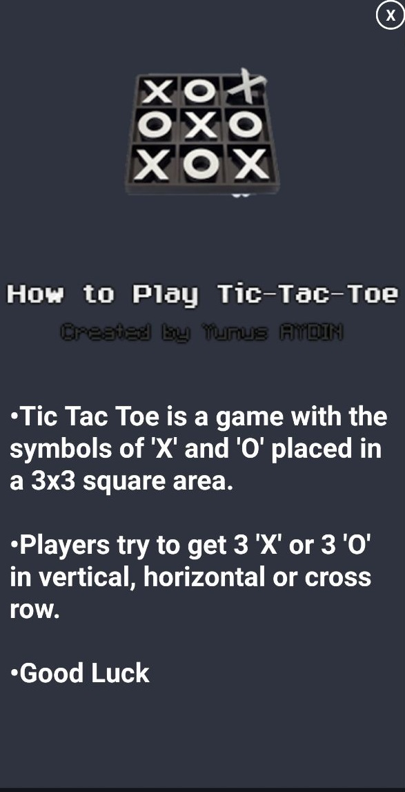
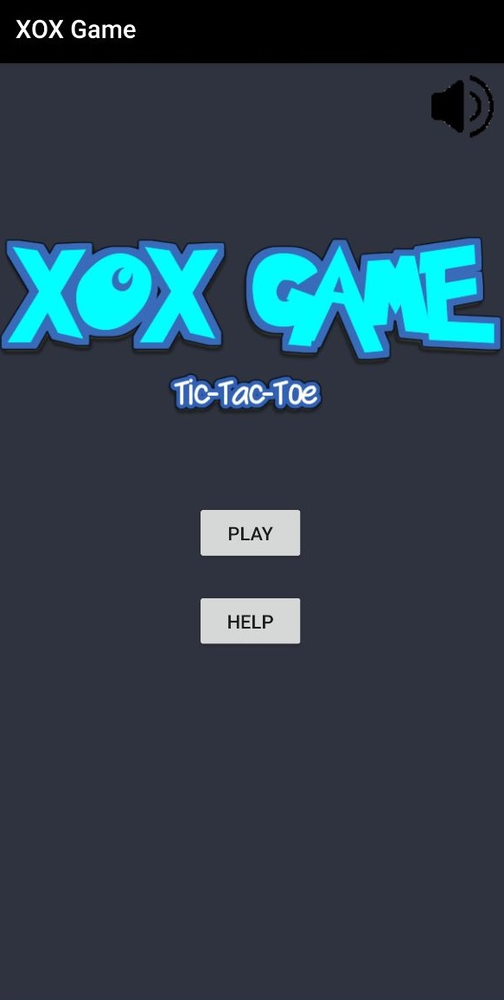
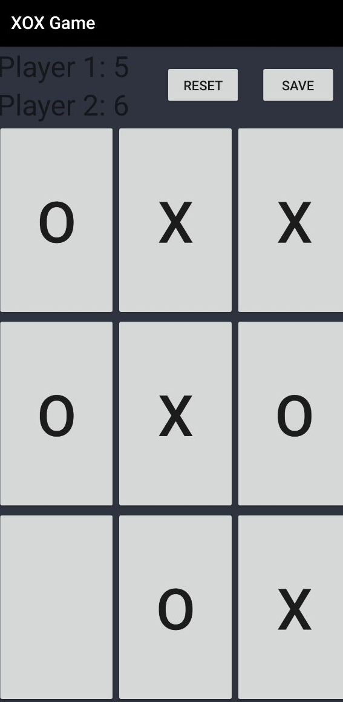
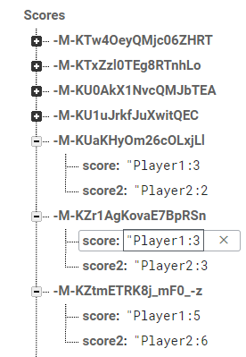

# TicTacToe-Android

## TO BE CONTINUED

##### Tic-tac-toe is a paper-and-pencil game for two players, X and O, who take turns marking the spaces in a 3×3 grid. The player who succeeds in placing three of their marks in a horizontal, vertical, or diagonal row wins the game. To add this project to android studio.

## How to Play Tic Tac Toe ?

## Features

•Two Player

•Multiplayer (Soon)

•Top 10 of Multiplayers.

•Save Score to FireBase,Be First , Won Awards !

•Musics

## Getting Started

•In android studio goto file

•Select new > Import from version control

•Choose git / github (git option recommended )

•Paste url to repository i.e https://github.com/aydinnyunus/TicTacToe-Android.git

•Click on clone.

## FireBase System

Save Nicknames and Scores to Create Ranking.

